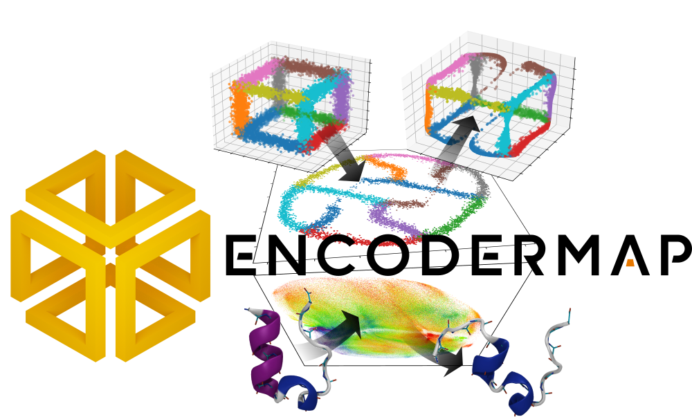

[](https://ag-peter.github.io/encodermap/_static/html_test_runner_report.html)
[](https://ag-peter.github.io/encodermap/_static/coverage/)

[](https://www.gnu.org/licenses/lgpl-3.0)
[](https://github.com/psf/black)


## Introduction
For a quick intro have a look at the following video:

[<p align="left">  </p>](https://youtu.be/JV59OABhNTY)

You can find more information in these two articles:

[Lemke, Tobias, and Christine Peter. "EncoderMap: Dimensionality Reduction and Generation of Molecule Conformations." Journal of chemical theory and computation 15.2 (2019): 1209-1215.](https://pubs.acs.org/doi/abs/10.1021/acs.jctc.8b00975)

[Lemke, T., Berg, A., Jain, A., & Peter, C. "EncoderMap (II): Visualizing important molecular motions with improved generation of protein conformations" Journal of chemical information and modeling (2019).](https://doi.org/10.1021/acs.jcim.9b00675)

## Documentation

Find the documentation at:

https://ag-peter.github.io/encodermap/


## Quick start

To get started right away, you can try out the tutorial notebooks at mybinder.org:

[](https://mybinder.org/v2/gh/AG-Peter/encodermap/HEAD)


## Installation

**Version 3.0.0 is currently not on PyPI. Install with:**

```bash
pip install git+https://github.com/AG-Peter/encodermap.git
```

**Install optional packages for using MD data:**

```bash
pip install -r https://raw.githubusercontent.com/AG-Peter/encodermap/main/md_requirements.txt
```

EncoderMap requires TensorFlow >=2.9 to be installed.
Follow the [instructions on the TensorFlow website](https://www.tensorflow.org/install/pip) to install it
either in the cpu or gpu version.
Then install EncoderMap with pip.
If you want to install it in your home directory use:
```bash
pip3 install --user encodermap
```
If you are in a virtual environment use:
```bash
pip3 install encodermap
```

## Minimal Example
This example shows how to use EncoderMap to project points from a high dimensional data set to
a low dimensional space using the default parameters.
In the data set, each row should represent one data point and the number of columns should be equal to the
number of dimensions.
```python
import encodermap as em
import numpy as np

high_dimensional_data = np.loadtxt("my_high_d_data.csv", delimiter=",")
parameters = em.Parameters()

e_map = em.EncoderMap(parameters, high_dimensional_data)
e_map.train()

low_dimensional_projection = e_map.encode(high_dimensional_data)
```
The resulting `low_dimensional_projection` array has the same number of rows as the `high_dimensional_data`
but the number of columns is two as high dimensional points are projected to a 2d space with default settings.

In contrast to many other dimensionality reduction algorithms EncoderMap does not only allow to efficiently project
form a high dimensional to a low dimensional space. Also the generation of new high dimensional points for any
given points in the low dimensional space is possible:
```python
low_d_points = np.array([[0.1, 0.2], [0.3, 0.4], [0.2, 0.1]])
newly_generated_high_d_points = e_map.generate(low_d_points)
```
## Tutorials
To get started please check out the [tutorials](tutorials).

Also, have a look at the [examples](encodermap/examples).

## Documentation
More information is available in the [documentations](https://ag-peter.github.io/encodermap/).

## Questions
If you have any questions you can have a look at the [FAQ](questions.md) (not very extensive yet), and you are most welcome to [open an issue here on GitHub](https://github.com/AG-Peter/encodermap/issues/new).

## Citations

```
@article{lemke2019encodermap,
  title={Encodermap: Dimensionality reduction and generation of molecule conformations},
  author={Lemke, Tobias and Peter, Christine},
  journal={Journal of chemical theory and computation},
  volume={15},
  number={2},
  pages={1209--1215},
  year={2019},
  publisher={ACS Publications}
}
```

```
@article{lemke2019encodermap,
  title={EncoderMap (II): Visualizing important molecular motions with improved generation of protein conformations},
  author={Lemke, Tobias and Berg, Andrej and Jain, Alok and Peter, Christine},
  journal={Journal of Chemical Information and Modeling},
  volume={59},
  number={11},
  pages={4550--4560},
  year={2019},
  publisher={ACS Publications}
}
```
