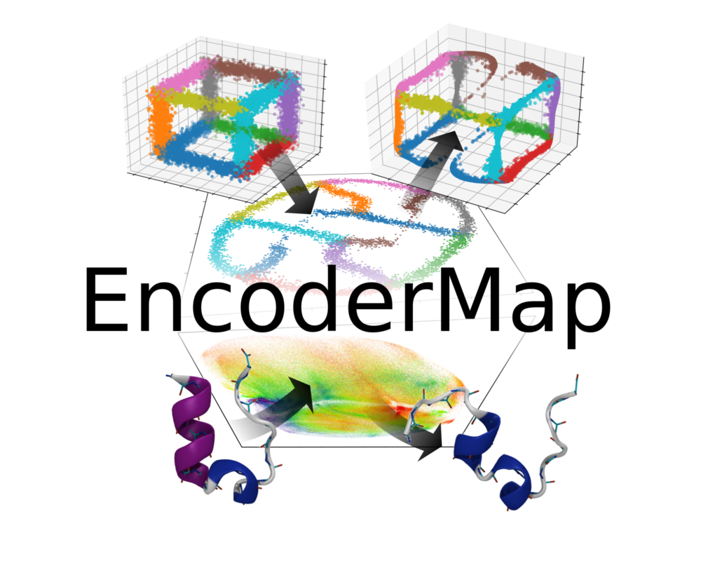

For a quick intro have a look at the following video:  
[](https://youtu.be/JV59OABhNTY "Introduction to EncoderMap")

You can find more details in this article:  
[Lemke, Tobias, and Christine Peter. "EncoderMap: Dimensionality Reduction and Generation of Molecule Conformations." Journal of chemical theory and computation 15.2 (2019): 1209-1215.](https://pubs.acs.org/doi/abs/10.1021/acs.jctc.8b00975)

## Installation
EncoderMap requires TensorFlow to be installed.
Follow the [instructions on the TensorFlow website](https://www.tensorflow.org/install/pip) to install it 
either in the cpu or gpu version.
Then install EncoderMap with pip.
If you want to install it in your home directory use:
```bash
pip3 install --user encodermap
```
If you are in a virtual environment use:
```bash
pip3 install encodermap
```

## Minimal Example
This example shows how to use EncoderMap to project points from a high dimensional data set to
a low dimensional space using the default parameters. 
In the data set, each row should represent one data point and the number of columns should be equal to the
number of dimensions. 
```python
import encodermap as em
import numpy as np

high_dimensional_data = np.loadtxt("my_high_d_data.csv", delimiter=",")
parameters = em.Parameters()

e_map = em.EncoderMap(parameters, high_dimensional_data)
e_map.train()

low_dimensional_projection = e_map.encode(high_dimensional_data)
```
The resulting `low_dimensional_projection` array has the same number of rows as the `high_dimensional_data` 
but the number of columns is two as high dimensional points are projected to a 2d space with default settings.

In contrast to many other dimensionality reduction algorithms EncoderMap does not only allow to efficiently project
form a high dimensional to a low dimensional space. Also the generation of new high dimensional points for any 
given points in the low dimensional space is possible:
```python
low_d_points = np.array([[0.1, 0.2], [0.3, 0.4], [0.2, 0.1]])
newly_generated_high_d_points = e_map.generate(low_d_points)
```
## Tutorials
To get started please check out the [tutorials](tutorials).

## Documentation
More information is available in the [documentations](https://ag-peter.github.io/encodermap/).
