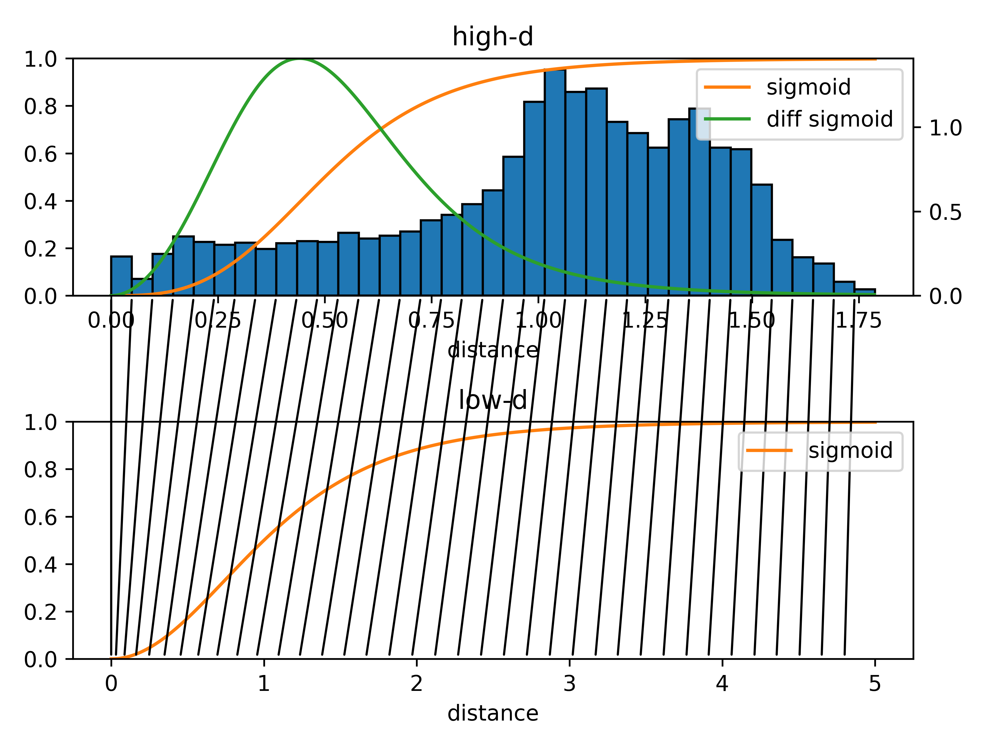

## Frequently Asked Questions

### All high-dimensional points are projected to a single point in the map. What is wrong?
Probably the used sigmoid parameters are not suitable for your data set.
Check the sigmoid parameters using the distance_histogram function as shown in the [cube_distance_analysis example](encodermap/examples/cube_distance_analysis.py).
This will create a plot like this:

  

In the above example the dist_sig_parameters are set to (10, 3, 6, 1, 2, 6).
The high-d sigma of 10 is much to high for the example data.
The black lines connecting the plots of the high-d sigmoid (top) and the low-d sigmoid (bottom) indicate to which low-dimensional distances high-dimensional distences are ideally mapped with your choice of sigmoid parameters.
With such a choice of a too large high-d sigma value, all high-d distances are maped to verry small low-d distances which could explain why all points in the map are on top of eachother.
With a more reasonable choice of the high-d sigma the plot would look somewhat like this:

  

The ideal sigmoid parameters depend on the question what you want to have separated or not separated in the map which can not universally be answered.

### Why does my map exhibit a weird grid-like pattern?
Grid patterns tend to appear when the auto cost is strongly weighted compared to the the distance cost(Sketchmap cost).
Have a look at Figure S2 in the [supplement of the first EncoderMap paper](https://pubs.acs.org/doi/suppl/10.1021/acs.jctc.8b00975/suppl_file/ct8b00975_si_001.pdf) where we discuss this matter.
If you are only interested in the map and not in the decoder, you can also try to turn off the auto cost completely (set auto_cost_scale = 0).
Then you will obtain a map purely optimized according to the distance cost.
