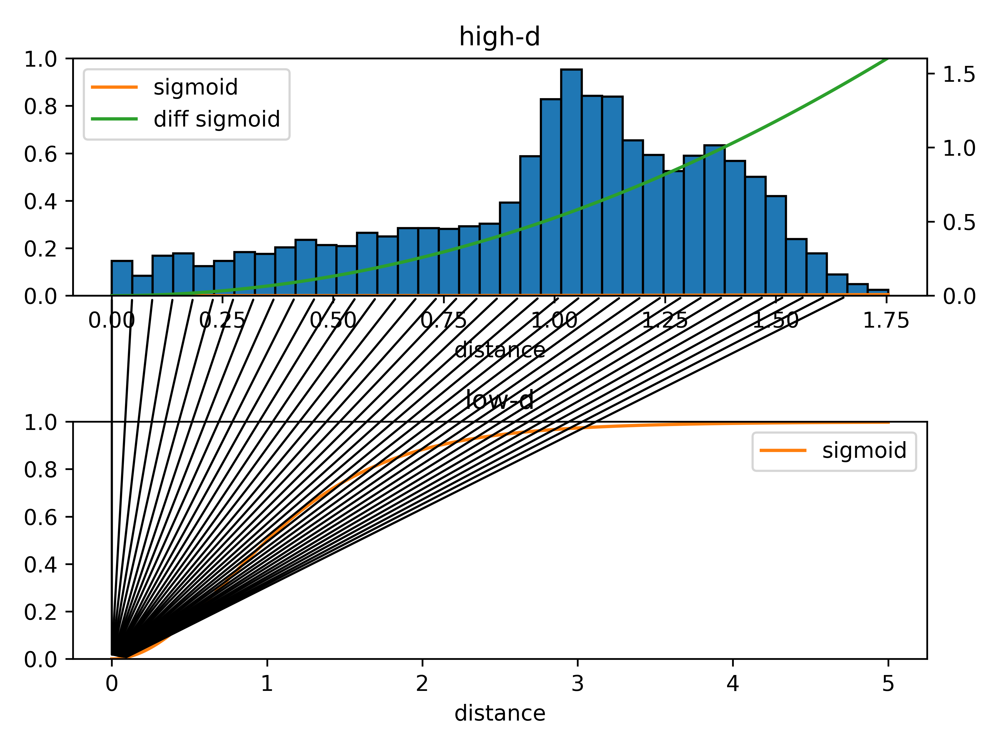

## Frequently Asked Questions

### All high-dimensional points are projected to a single point in the map. What is wrong?
Probably the used sigmoid parameters are not suitable for your data set.
Check the sigmoid parameters using the distance_histogram function as shown in the [cube_distance_analysis example](encodermap/examples/cube_distance_analysis.py)

  

In the above example the dist_sig_parameters are set to (10, 3, 6, 1, 2, 6). 
The high-d sigma of 10 is much to high for the example data.
The black lines connecting the plots of the high-d sigmoid (top) and the low-d sigmoid (bottom) indicate to which low-dimensional distances high-dimensional distences are ideally mapped with your choice of sigmoid parameters.
With such a choice of a too large high-d sigma value, all high-d distances are maped to verry small low-d distances which could explain why all points in the map are on top of eachother.

